# Siemens AI Rad Companion - semi automated comparison with Radiologists' annotations

> This tool can be used to compare Siemens AI Rad Companion nodule detection software output with the one of the radiologists (considered as ground truth). The python file that does is the [automated_nodule_comparison.py](./automated_nodule_comparison.py)

**For this tool to run, the following files should be executed first:**

  - A file that exports from REDCap the actual findings annotated by the radiologists. This file creates one csv file per participant and can be found [here](./redcap_patient_extraction.py) 

  - A file that will create a csv file with the AI detected nodules (z coordinates that will be converted in slices with our algorithm) and their volumes. This file also uses [AI_timestamp.ipynb](./AI_timestamp.ipynb) to decide which is the latest AI file to keep in case a participant was sent more than once to the AI. The file that actually creates our csv is the [AI_aorta_calcium_nodules_emphysema_vertebra_fat_to_REDCap.ipynb](./AI_aorta_calcium_nodules_emphysema_vertebra_fat_to_REDCap.ipynb)

**To create the structure needed to run the code we need to follow these steps:**
 - Create a folder to store the scans, including the original scan, the AI overlayed scan, and the `Results` with nodules (and possibly the SEG masks of nodules, and the structure reports)
 - Inside that folder, create empty folders, each with the 6-digit participant id as its name.
 - Download the above mentioned files inside each participant's folder. 
  - To download a scan we open `syngo.via` and login with your details, as shown below 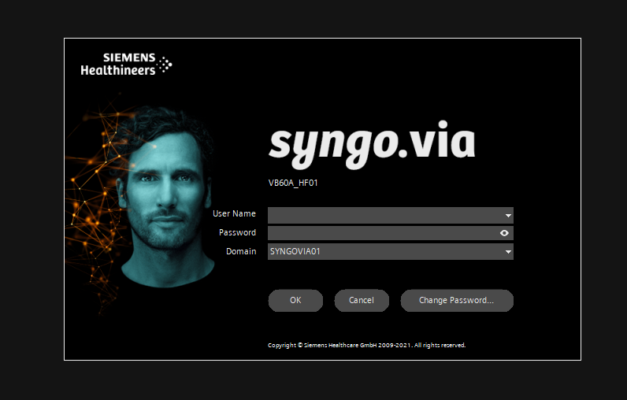
  - Search for a specific participant id in the PACS (e.g. Orthanc) by clicking the `DICOM Q/R` icon on the top right corner of the panel 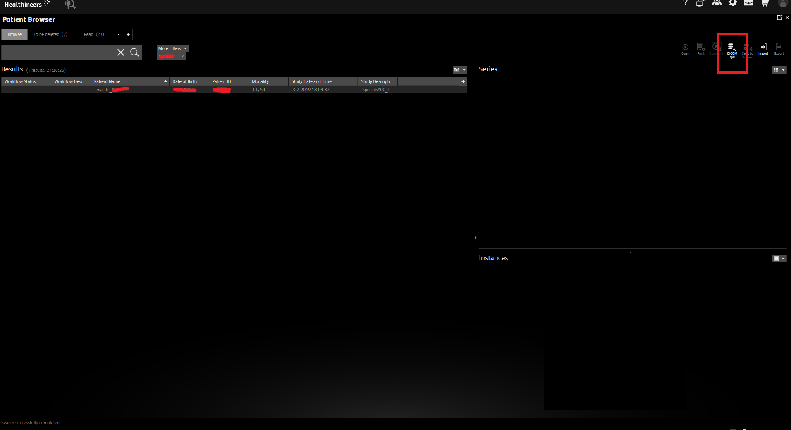 and then `Search Filters`. 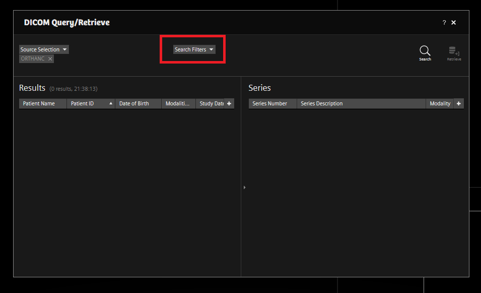 Input the ID (sometimes a `*` in front is needed) and hit enter 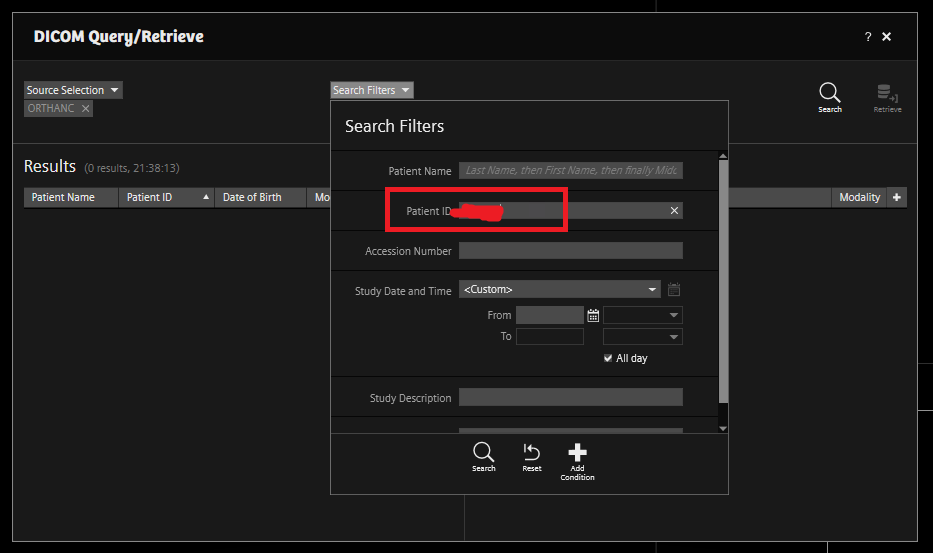 
   - In the panel that shows up, select the scan you would like to export. Be sure to select the baseline and not the repeat scan by noting the `study date` 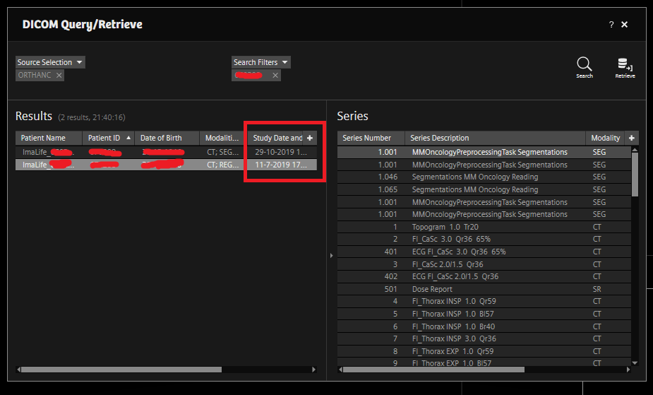
   - Select the original scan denoted as `Fl_Thorax...Qr59`. If there are many options, select the inspiration `INSP` scan 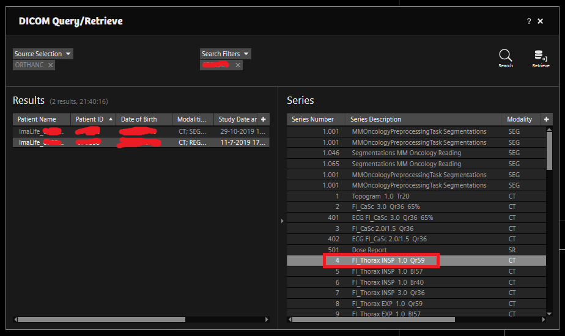 Select the other files with `Ctrl+click`. 
   - For the `Results` folder with the nodule annotations, select all files denoted as `Results MM Oncology Reading`. Ensure that these contain just the contour of the nodule without any additional information about its characteristics overlayed in that image. An example of such an image can be seen [below](./images/results_annotation.png). 
   - Select the overlayed scan with AI measurements denoted as `Fl_Thorax... Qr59 LungLesions`. Click `Retrieve` on the top right corner on the showed up panel 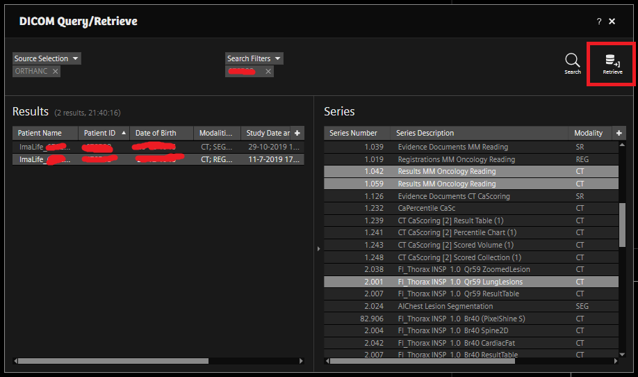

     * Segmentation files are denoted as `Segmentations MM Oncology Reading` and are not needed for our algorithm to work properly.
     * The structure report is denoted as `Evidence Documents MM Oncology Reading` and is similarly non-essential for our algorithm to work. 
 
   - To check the progress of a scan that is being downloaded from the PACS, we click the suitcase icon on the top right corner 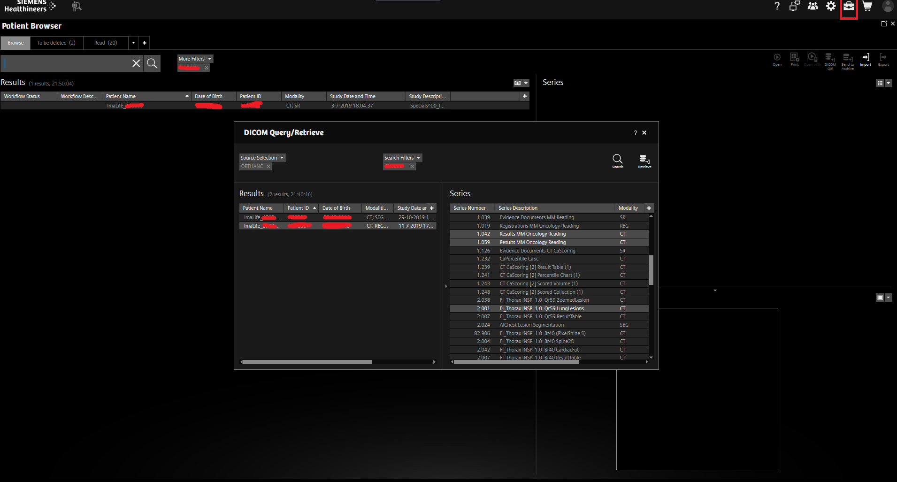 An example of how this will looks like is shown below 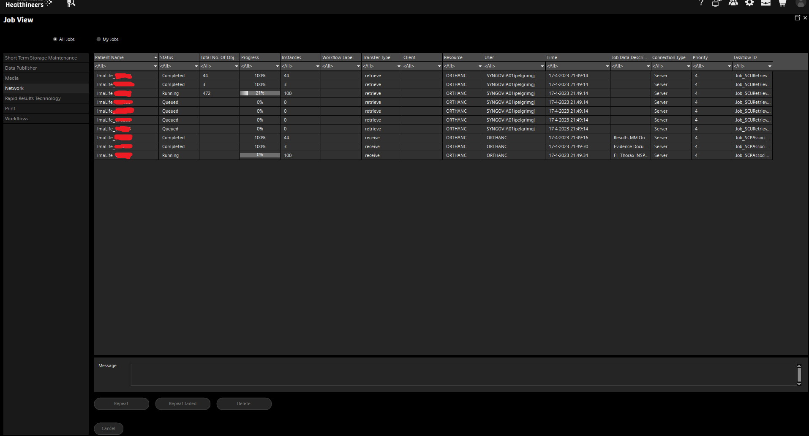 Once all files have been downloaded, the `Status` for files of a specific participant will be marked as `completed`, as shown below 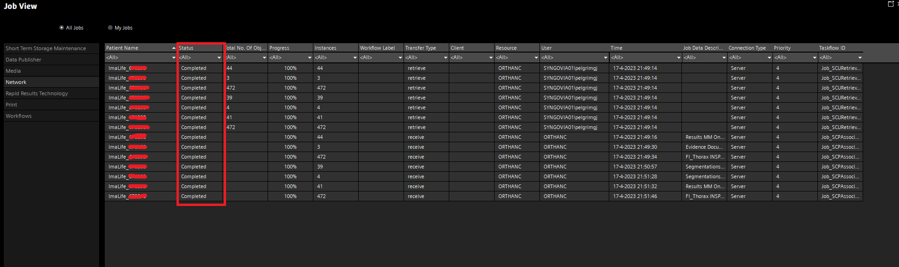
   - To search for a participant we click the empty icon located below `More Filters` in the main syngo.via window, and enter the ID of the participant 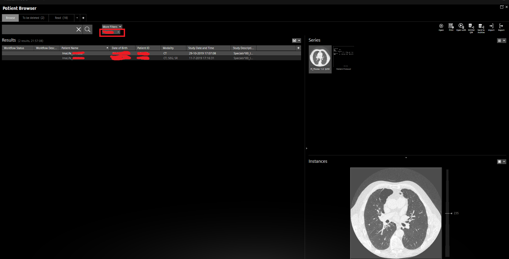
   - Choose the correct scan based on the study date on the left menu. All files that have been downloaded from the PACS can be seen on the right side panel. 
   - Select the downloaded files and click `Export` in the top right corner 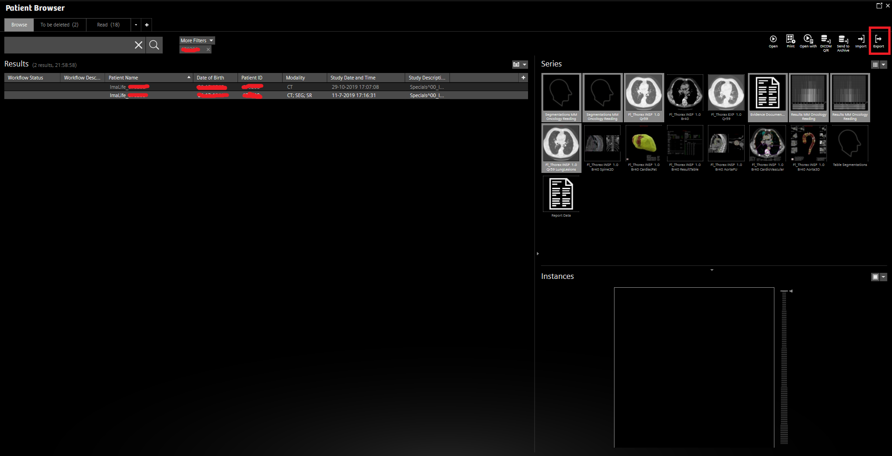
   - In the new panel wait until all selected files show up and then click the `Browse icon` to select the folder you created for the participant. Finally, click `Export` on that panel. 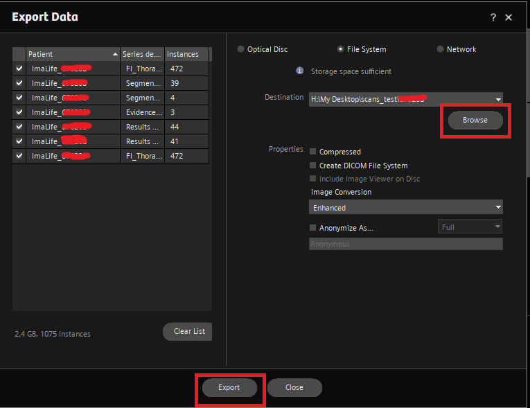 
   - To monitor the progress of the downloads click the `suitcase` icon again and then click `Media` on the left. 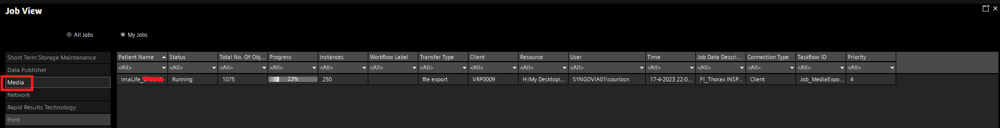 Once the `progress` becomes `100%` the scan files will appear in the designated folder and we would be ready to run our algorithm.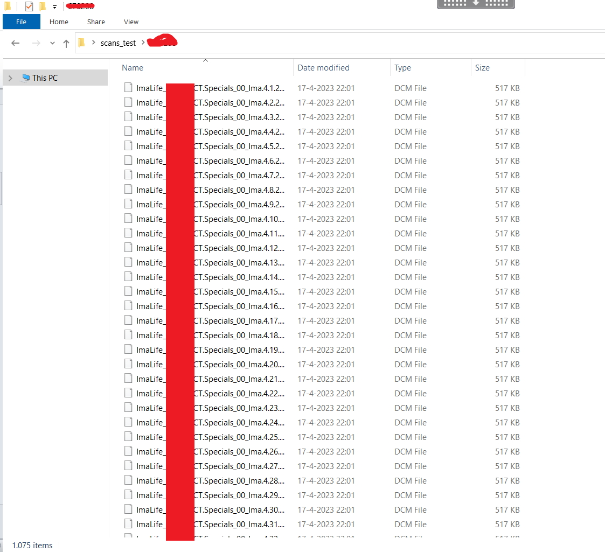 

Apart from the scan files, one csv file export from REDCap saved in specified folder, is also required. To generate these files the code in [redcap_patient_extraction.py](./redcap_patient_extraction.py) was run. This code creates a csv file inside our folder named with the 6-digit participant id and it contains all attributes separated by a `,` as seen below 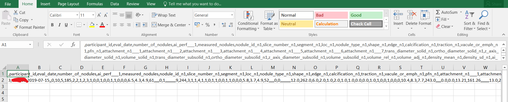
  
Finally, an excel file with AI detected nodules is obtained by running [AI_aorta_calcium_nodules_emphysema_vertebra_fat_to_REDCap.ipynb](./AI_aorta_calcium_nodules_emphysema_vertebra_fat_to_REDCap.ipynb). The resulting excel file looks like the one shown below 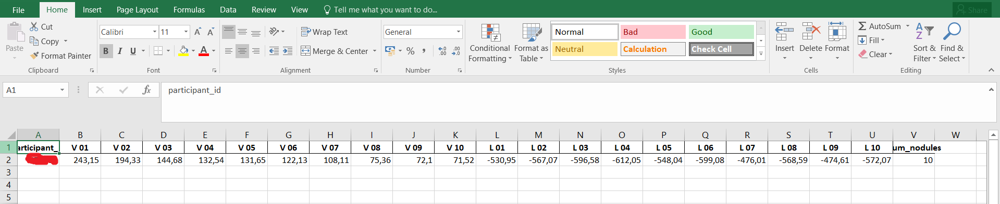 It will contain many participant IDs (one in each row) along with information from the output txt files of the AI. An example of such a txt file with only nodule information can be found [here](./1.2.276.0.28.3.345049594267.42.7220.20220705105655000.txt). There might be different txt files for the same participant, each one sent to AI for different reasons (nodule detection, aorta measurements etc.). Some files might also contain errors (eg. missing slices).

The file [AI_aorta_calcium_nodules_emphysema_vertebra_fat_to_REDCap.ipynb](./AI_aorta_calcium_nodules_emphysema_vertebra_fat_to_REDCap.ipynb) will use some dictionaries (in the form of pickle objects) that store information of the files that correspond to each participant. This is there might be more than one file per participant. The pickle dictionaries were created using [AI_timestamp.ipynb](./AI_timestamp.ipynb). This file uses some log txt files containing information about the duration needed for the AI to process a scan (nodule detection, aorta measurements etc.). On top of that, it contains information about the number of slices processed (which can be used to identify possible errors, if case not all of them were processed). 

The pickle dictionaries are dictionaries with each participant ID and the name of the most recent file that was sent to AI or the file with the most slices that wwas processed by it. File names of files processed by [AI_timestamp.ipynb](./AI_timestamp.ipynb) will be the same as the ones that [AI_aorta_calcium_nodules_emphysema_vertebra_fat_to_REDCap.ipynb](./AI_aorta_calcium_nodules_emphysema_vertebra_fat_to_REDCap.ipynb) will use to extract information from. An example of a file with the duration of each task can be found [here](./1.2.276.0.28.3.345049594267.42.2584.20221028035850000.txt). 

 
# [automated_nodule_comparison.py](/automated_nodule_comparison.py)

The following paths need to be provided:

- Path of folder for saving the output images and txt files
- Path of folder containing one csv file for each participant with the slices of nodules (REDCap). Each CSV file should have the following columns:
  - A `slice` column indicating the slice number of the original scan where the nodule is located
  - A `nodule_id` column indicating the ID of the nodule for each slice
  - Two columns `volume_solid` and/or `volume_subsolid` providing information about the nodule components (if any)

- Path of an XLSX file with slices where nodules were detected by AI. This file has one column with participant IDs, followed by 10 columns for the volumes of each nodule found, 10 columns with the relative position of the participant in the table (while undertaking the CT scan) where nodules were found (will be converted to slice numbers), and a final column with the total number of nodules for each participant. If a participant has less than 10 nodules, some fields will be filled with `-`.

- Path of a folder containing subfolders with anonymized participant IDs (6 digit numbers). These subfolders should contain DICOM files of at least the following:

1. Original CT scans (one file for each slice)

    An example of a CT DICOM slice can be seen in the screenshot below:

    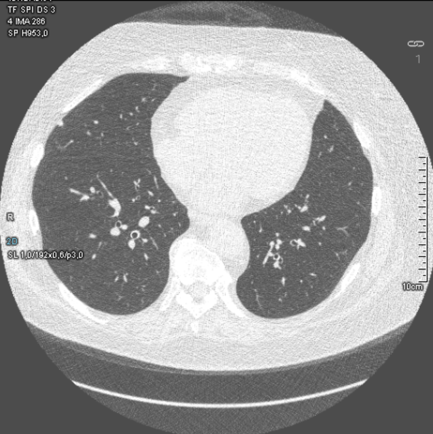

2. CT scans with AI annotations/detections overlayed on top

   An example of an AI DICOM slice with a nodule can be seen in the screenshot below:

   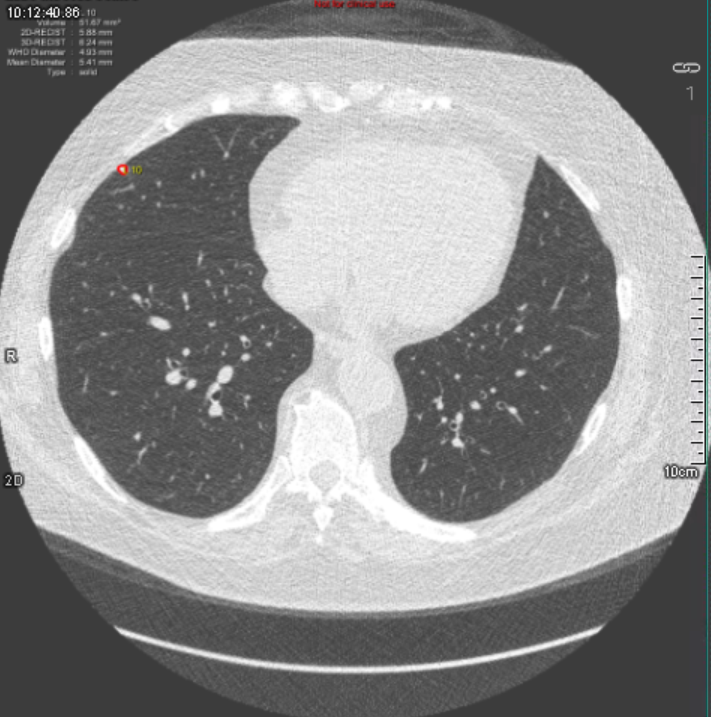

 3. Some 2D slices with the nodule contours (referred to as annotated CT files)

    An example of a DICOM slice with the nodule contour outlined (changed in a proper colormap for visualization) can be seen in the screenshot below:

    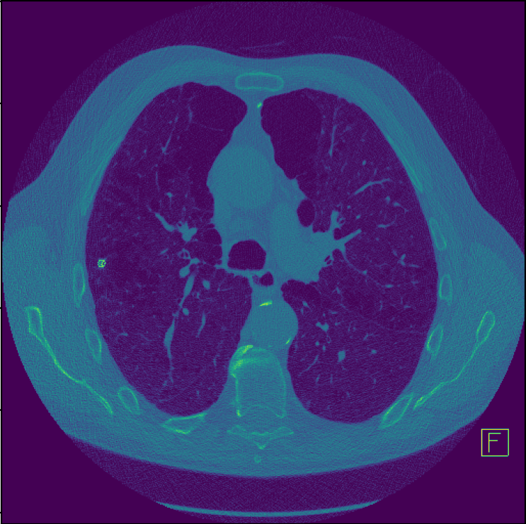

 4. If available, 3D segmentation masks of the nodules 
 5. If available, any other non-CT data (eg. structural reports), which will not be used by our tool/processing pipeline

## Brief description of how this tool works

The algorithm will go through a folder containing DICOM files and identify which files correspond to the original CT scan, the AI output scan with nodule contours, the annotated CT scan slices with nodule contours, and any files containing a SEG mask, if they exist. 

The program will store the CT slices of the original scan have annotated slices with nodules in one variable and will keep track of which AI slices might contain nodules in another.

Since the annotated slices with radiologists' annotations might contain non-nodule findings, the algorithm needs to check if a finding is a nodule or not (actual nodules saved in REDCap, `Results` have additional non-nodule findings). Similarly, because there might be more than one nodule in each AI scan slice, the program needs to distinguish where each nodule can be found, along with its ID. 

However, sometimes an annotated CT slice may not be on the same slice as the ground truth slice in the REDCap file where the actual slices with annotations are saved. This can happen because a nodule might be extended in more than one slices, and radiologists outlined it only in one slice. Thus, the algorithm checks some of the nearby slices to compare them with the annotated slice. The same check is performed for the nearby slices from which AI detected nodules to make sure that there is no confusion between true positives (TP) and false positive (FP) nodules.

Once the program identifies which of the annotated CT slices contain nodules and in which slice these nodules are present, it compares their contour with the contour of the same AI slice, if one exists. If there is overlap, the nodule is considered a TP. If not, it is a FN. If the algorithm detects nodules in the AI scan slices for which thre is no correspondence with an annotated CT slice, it considers these nodules as FP. 

To solve some specific issues, such as one TP and one FN nodule in the same slice, more details can be seen in the code. The main challenge faced in the program is to find the correspondance between each detection and its respective nodule ID.

Finally, the images of FPs and FNs are saved for a blinded review by radiologists. These should not be aware if it's an AI detection or a detection by other radiologists.

#### Failures/Limitations of the algorithm

This algorithm may fail to correctly identify at least one nodule in the following cases (for which the output is an empty line):

1. When a participant has more than 10 nodules. This occurs because AI detects extra nodules and places a red bounding box around them. It's impossible to identify which bounding boxes correspond to the 10 nodules reported by the AI and which belong to the extra detections. These extra detections are nodules that received a lower confidence score from the AI.
2. Sometimes, the AI slice from the xlsx file does not correspond to a slice that actually contains a nodule (i.e., it's close to it but doesn't have a red nodule contour). The algorithm will fail in those cases.
3. If the same AI slice contains more than one nodule, and one of them is a TP while the other is a FP, the resulting images may not be correctly identified (as in case 673634). More generally, if the same slice appears more than twice in ground truth slices, the algorithm will generate an error. 
4. If the ground truth slice is different from the one in the annotated CT slices, we may encounter issues.
5. If there are two false negatives in the same slice, an error may occur.
6. If there are three consecutive FP slices, the algorithm will fail.
7. The most important failure is the one that **will not raise an error**. This can happen if there are errors in the xlsx file with the ID numbers of the nodules. For example, if radiologists accidentaly noted that the nodule with ID 1 is in slice 277 while the nodule with ID 2 is in slice 329 when it's actually the other way around, our algorithm won't raise any errors. These errors cannot be avoided, which is why a second manual verification of findings is needed. This is the same as confirming that the information in the database is correct. 

- Additionally, errors might be raised in some other cases (empty fields in the output Excel file). These cases should be checked and filled in manually.
- TP images are not currently extracted properly. Although some initial steps are included in our code, they won't work correctly if executed (which is why this part of the code is commented out for now)

## Detailed description of main functions used 

After setting the paths, the algorithm performs the following steps:

- Saves all CT files (AI, original scan files, annotated CT image names), in different variables as well as the total slices in the SEG files, in AI output, and the total number of CT slices (original scan). It also saves information of any possible errors in a text file. It is assumed that the input path only contains DICOM files of a specific participant.
- Correlates annotated CT slices with slices of the original scan. This means that it finds the slice number of the annotated 2D slice with the nodule contour. On top of the above, it also detects any empty CT slices and files with possible missed nodules due to low threshold (set to distinguish which CT slice is similar to a slice in annotated CT slices).
- Plots the nodules in the SEG files and saves the files in new variables with the correct order. These are SEG files and their corresponding original CT slices, and annotated CT slices. It also provides information of the SEG slices with errors.

After these steps, we end up with a few variables of interest that we will use to get our final results:
- CT scan slices with nodules
- Annotated slices of the above CT slices with the nodule contour
- Possible segmentation masks that correspond to the above nodules
- Possible errors in the above segmentation masks

Next, our algorithm extracts information from the CSV files of each participant extracted from REDCap. It finds which slices might contain nodules, as well as their nodule IDs and their volume. These are the actual nodules slices. The annotated CT slices we have until know might also contain findings that are not nodules and were just noted by the radiologists. Similarly, it will find in which slices there are AI detected nodules and their slice number, ID, and their volume, as quantified by the AI. 

It should be noted that all available CPU cores are utilized to run the above-mentioned steps in parallel.

At last, some screenshots of when a nodule is a TP, a FP and a FN are presented below:

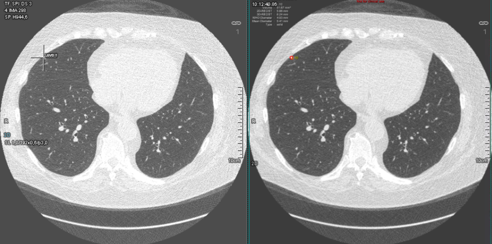
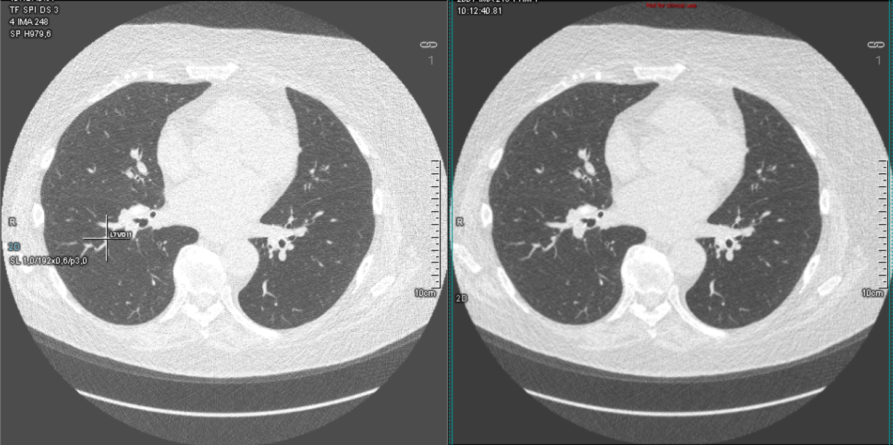
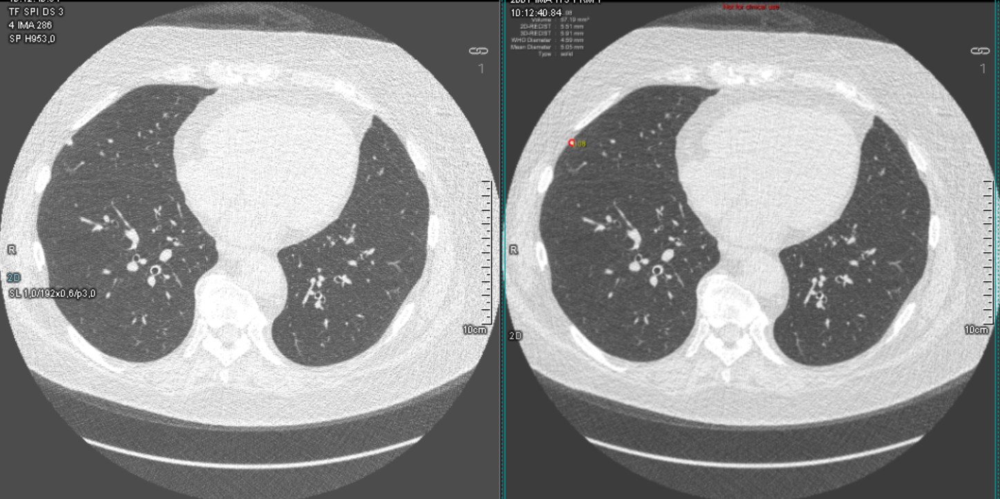

<!-- 

 -->

PS. Text above was written with the help of chatGPT. A first version was created by the user and then the following prompt was used for the final result:

> Below code and text contained in a readme.md file is provided. Rephrase the text only to be more easily readable, keep the format as is, and return it as code that can be copy pasted: 

## Contributing
Pull requests are welcome. For major changes, please open an issue first to discuss what you would like to change.

 
## License
[MIT License](LICENSE)
